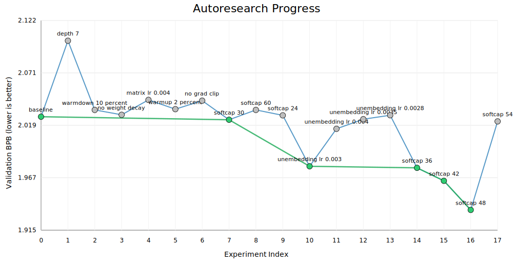

# autoresearch-origin


# autoresearch-for-AGX-Orin



This repository is a Jetson AGX Orin oriented fork of Karpathy's `autoresearch`: a tiny autonomous LLM research loop where an agent edits [`train.py`](train.py), runs a fixed-time training job, checks the validation score, and keeps or discards the idea.

This fork is tuned for:

- Jetson AGX Orin
- Jetson Linux R35 / JetPack 5.x
- Docker-first usage
- stable, conservative defaults instead of H100-style aggressive settings

## What This Repo Does

The repo has four main pieces:

- [`prepare.py`](prepare.py): downloads text shards, builds the tokenizer, and provides the fixed dataloader and evaluation utilities
- [`train.py`](train.py): builds the model, trains for a fixed 5-minute budget, logs the run, and appends the result to `results.tsv`
- [`analyze_results.py`](analyze_results.py): reads `results.tsv`, prints summary stats, and generates a progress plot
- [`program.md`](program.md): instructions for an external coding agent to run autonomous experiment loops

The benchmark target is:

- `val_bpb` = validation bits per byte
- lower is better

## What Changed From The Original Repo

The upstream project was tuned for much larger NVIDIA GPUs. This fork changes the runtime so it is practical on Orin:

- Docker image based on NVIDIA Jetson PyTorch container
- smaller model and batch defaults
- simpler attention backend defaults
- `torch.compile` disabled by default
- byte-level tokenizer fallback enabled by default
- automatic `run.log` generation
- automatic `results.tsv` updates after each run
- terminal-friendly analysis script

## Quick Start

From the Jetson host:

```bash
cd /home/pi/autoresearch
./docker/build-jetson.sh
./docker/run-jetson.sh
```

Inside the container:

```bash
python3 prepare.py --num-shards 4
AUTORESEARCH_RUN_DESCRIPTION="jetson orin baseline" python3 train.py
python3 analyze_results.py
```

That gives you:

- one full training run
- a detailed [`run.log`](run.log)
- one appended row in [`results.tsv`](results.tsv)
- a generated progress plot such as `autoresearch_progress.png` or `autoresearch_progress.svg`


## Typical Workflow

### 1. Prepare data once

```bash
python3 prepare.py --num-shards 4
```

This creates the cache under the container's default cache path and prepares:

- downloaded parquet shards
- tokenizer files
- token byte lookup used for `val_bpb`

### 2. Run one experiment

```bash
AUTORESEARCH_RUN_DESCRIPTION="baseline" python3 train.py
```

`train.py` will:

- load the tokenizer and training data
- build the current model defined in [`train.py`](train.py)
- train for a fixed 300-second budget
- evaluate the final model on validation data
- write a detailed step-by-step [`run.log`](run.log)
- append a row to [`results.tsv`](results.tsv)

### 3. Analyze progress

```bash
python3 analyze_results.py
```

This prints:

- total experiments
- `KEEP` / `DISCARD` / `CRASH` counts
- baseline and best result
- kept experiments list

and also generates a progress plot from [`results.tsv`](results.tsv).

## Output Files

After running experiments, the important files are:

- [`run.log`](run.log): full per-step log for the most recent run
- [`results.tsv`](results.tsv): experiment history table
- `autoresearch_progress.png` or `autoresearch_progress.svg`: progress chart

The TSV columns are:

```text
commit	val_bpb	memory_gb	status	description
```

Where:

- `commit`: current git short hash
- `val_bpb`: validation bits per byte
- `memory_gb`: peak GPU memory in GB
- `status`: usually `keep`, `discard`, or `crash`
- `description`: human-readable experiment note

## Understanding The Final Training Output

At the end of a successful run, [`train.py`](train.py) prints a block like:

```text
---
val_bpb:          2.025186
training_seconds: 300.0
total_seconds:    311.0
peak_vram_mb:     1260.7
mfu_percent:      0.00
total_tokens_M:   18.3
num_steps:        1117
num_params_M:     2.8
depth:            6
```

The most important metric is:

- `val_bpb`

Lower is better. This is the number you compare across experiments.

## Logging Behavior

`train.py` now handles logging automatically.

It writes:

- terminal live progress as a single updating line
- newline-delimited per-step history to [`run.log`](run.log)
- one final row to [`results.tsv`](results.tsv)

So you do **not** need to redirect output manually just to keep logs.

## Plotting Progress

There are two ways to analyze progress:

### Terminal-first

Use:

```bash
python3 analyze_results.py
```

This is the recommended Jetson workflow.

It works even if `matplotlib` is not installed:

- with `matplotlib`, it saves a PNG plot
- without `matplotlib`, it falls back to an SVG plot

### Notebook

[`analysis.ipynb`](analysis.ipynb) is still included as a richer notebook-based analysis view. It was written for the original `results.tsv` workflow and is useful if you want a Jupyter-based summary.

Note:

- the minimal Jetson container does not install notebook-only analysis dependencies by default
- use [`analyze_results.py`](analyze_results.py) if you want the simplest built-in path

## Docker Notes

The helper script [`docker/run-jetson.sh`](docker/run-jetson.sh) starts the container with:

- `--runtime nvidia`
- `--network host`
- `--ipc host`
- a bind mount of the repo into `/workspace/autoresearch`
- a named Docker volume for the autoresearch cache

The image defaults in [`Dockerfile.jetson`](Dockerfile.jetson) are intentionally conservative:

- `AUTORESEARCH_TOKENIZER_MODE=byte`
- `AUTORESEARCH_ATTENTION_BACKEND=eager`
- `AUTORESEARCH_AMP_DTYPE=fp32`
- `AUTORESEARCH_OPTIMIZER=adamw`
- `AUTORESEARCH_USE_VALUE_EMBEDS=0`
- `AUTORESEARCH_USE_COMPILE=0`
- `AUTORESEARCH_MAX_SEQ_LEN=512`
- `AUTORESEARCH_EVAL_TOKENS=524288`
- `AUTORESEARCH_VOCAB_SIZE=4096`

These defaults prioritize:

- stability
- reproducibility
- successful first runs on Orin

## Useful Environment Variables

### Run metadata

- `AUTORESEARCH_RUN_DESCRIPTION`: text stored in `results.tsv`
- `AUTORESEARCH_RESULT_STATUS`: status stored for successful runs, default `keep`
- `AUTORESEARCH_LOG_PATH`: log file path, default `run.log`
- `AUTORESEARCH_RESULTS_PATH`: results file path, default `results.tsv`

### Runtime controls

- `AUTORESEARCH_MAX_SEQ_LEN`: context length
- `AUTORESEARCH_EVAL_TOKENS`: validation token budget
- `AUTORESEARCH_TIME_BUDGET`: training budget in seconds
- `AUTORESEARCH_TOKENIZER_MODE`: `byte`, `rustbpe`, or `auto`
- `AUTORESEARCH_ATTENTION_BACKEND`: `eager`, `sdpa`, `kernel`, or `auto`
- `AUTORESEARCH_AMP_DTYPE`: `fp32`, `fp16`, `bf16`, or `auto`
- `AUTORESEARCH_OPTIMIZER`: `adamw` or `hybrid`
- `AUTORESEARCH_USE_VALUE_EMBEDS`: `0` or `1`
- `AUTORESEARCH_USE_COMPILE`: `0` or `1`
- `AUTORESEARCH_DEVICE_PEAK_FLOPS`: optional value for MFU estimation

## Agent Workflow

Once the repo is stable on your Jetson, you can point a coding agent at [`program.md`](program.md) and let it iterate on [`train.py`](train.py).

Prompt:
```bash
Hi, have a look at program.md and let's kick off a new experiment! Let's do the setup first. Run fully autonomously. Don't ask for confirmation between experiments. Keep going until I come back.
```

The intended loop is:

1. run a baseline
2. change only [`train.py`](train.py)
3. run another experiment
4. compare `val_bpb`
5. keep or discard the change
6. inspect progress with [`analyze_results.py`](analyze_results.py) or [`analysis.ipynb`](analysis.ipynb)

## Practical Expectations On Orin

Compared with the original larger-GPU setup, expect:

- much smaller models
- slower total throughput
- tighter memory constraints
- more conservative optimizer and precision settings
- simpler first-pass experiments

That is intentional. The goal of this fork is to make the research loop work reliably on Orin first, then tune upward carefully.

## Project Layout

```text
prepare.py               data prep, tokenizer, dataloader, evaluation
train.py                 model, optimizer, training loop, auto logging
analyze_results.py       terminal analysis + progress plot
analysis.ipynb           optional notebook analysis
program.md               autonomous experiment instructions
Dockerfile.jetson        Jetson AGX Orin container image
requirements-jetson.txt  Python deps for the container
docker/build-jetson.sh   image build helper
docker/run-jetson.sh     run helper
```

## License

MIT
